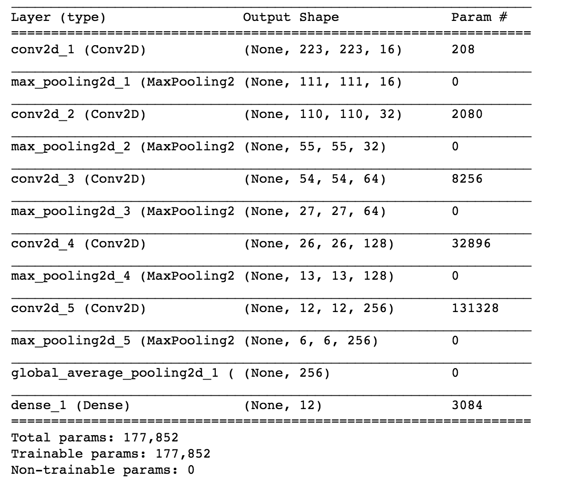

# Machine Learning Engineer Nanodegree
## Capstone Project
Charles Brands
July 10th, 2018

## I. Definition

### Project Overview
Farmers have been spraying their fields with herbicides for decades to reduce weeds. So far one herbicide mixture was used  to spray an entire field. This is not a very effective approach. Massive usage of herbicides are expensive, bad for the environment and may lead to resistance in the weeds. Also a herbicide mixture that is effective against one species of weed can have little or no effect on another species. Not to mention that the herbicide may be damaging to the crop it is supposed to protect. A better approach would be a system that can recognise weeds from crops and only spray at places where it is needed.

Aarhus University in Denmark is working on a project to create weedmaps of a field from a [tractor](https://vision.eng.au.dk/roboweedmaps/) to pinpoint where a certain species of weed resides on a field. They have released [a dataset](https://vision.eng.au.dk/plant-seedlings-dataset/) of images of 960 unique plants belonging to 12 species at several growth stages.

Kaggle is hosting this dataset as a Kaggle [competition](https://www.kaggle.com/c/plant-seedlings-classification). in order to give it wider exposure and to give the community an opportunity to experiment with different image recognition techniques.

### Problem Statement
For this project we have to detect which species of plant is in each image of the dataset described above. Each image contains one seedling which has to be classified into one of twelve species.
The solution to this problem is a model trained to predict the plant species for a given image.
* Input: An image of a plant.
* Output: The name of the plant species on the image.

#### Steps taken to complete this task
1. Imported the required data sets.
2. Displayed some sample images for each plant to get a visual idea of the problem.
3. Separate the data set into training, validation, and testing sets.
4. Do some preprocessing converting to tensors and normalization and so on.
5. Augmenting and oversampling the dataset by using horizontal flipping, rotation, zoom and so on.
6. Create a few models using the transfer learning approach with pre-trained network as well as a neural network started from scratch.
7. Fine tune the model(s) using different optimizers and adjusting multiple parameters.
8. The F1-score will be calculated as described in the section "Evaluation metrics" above.
9. Finally my score will be compared to the leaderboard on Kaggle.

The desired outcome of this project is to show that it is indeed possible to automatically detect weeds so the spraying of herbicides can be applied as sparingly and as effectively as possible.

### Metrics
I used the mean multi-class F1 score as the metric to evaluate my solution.
See [scikit-learn.org](http://scikit-learn.org/stable/modules/generated/sklearn.metrics.f1_score.html)
> The F1 score can be interpreted as a weighted average of the precision and recall, where an F1 score reaches its best value at 1 and worst score at 0. The relative contribution of precision and recall to the F1 score are equal. The formula for the F1 score is:

>In the multi-class and multi-label case, this is the weighted average of the F1 score of each class.

Precision is the ability of the classifier not to label as positive a sample that is negative. In formula:

Recall is the ability of the classifier to find all the positive samples. In formula:

The F1 score is also used by Kaggle as the metric to evaluate the solutions for this problem.[link](https://www.kaggle.com/c/plant-seedlings-classification#evaluation)

### Loss Function: Categorical Cross Entropy
Cross-entropy loss measures the performance of a classification model whose output is a probability value between 0 and 1. The lower the value the better the predicted probability matches the label. A perfect model would have a log loss of 0.
The formula for Categorical Cross Entropy is:

where ...
* M - number of classes (dog, cat, fish)
* ln - the natural log
* y - binary indicator (0 or 1) if class label c is the correct classification for observation o
* p - predicted probability observation o is of class c

More information can be found [here](http://ml-cheatsheet.readthedocs.io/en/latest/loss_functions.html) and [here](https://rdipietro.github.io/friendly-intro-to-cross-entropy-loss/).

## II. Analysis
### Data Exploration
The train and test datasets can be found on [kaggle](https://www.kaggle.com/c/plant-seedlings-classification/data). There are 4751 images for training and 794 images for testing. Each image has a filename that is its unique id. The dataset comprises 12 plant species. The list of species is as follows:

| Danish | English	| Latin | EPPO code |
| ------ | ------- | ----- | ----- |
| Majs | Maize | Zea mays L. | ZEAMX |
| Vinterhvede | Common wheat | Triticum aestivum L. | TRZAX |
| Sukkerroe | Sugar beet | Beta vulgaris var. altissima | BEAVA |
| Lugtløs kamille | Scentless Mayweed | Matricaria perforata Mérat | MATIN |
| Fuglegræs | Common Chickweed | Stellaria media | STEME |
| Hyrdetaske | Shepherd’s Purse | Capsella bursa-pastoris | CAPBP |
| Burresnerre | Cleavers | Galium aparine L. | GALAP |
| Agersennep | Charlock | Sinapis arvensis L. | SINAR |
| Hvidmelet gåsefod | Fat Hen | Chenopodium album L. | CHEAL |
| Liden storkenæb | Small-flowered Cranesbill | Geranium pusillum | GERSS |
| Agerrævehale | Black-grass | Alopecurus myosuroides | ALOMY |
| Vindaks |Loose Silky-bent | Apera spica-venti | APESV |
EPPO codes are computer codes developed for plants, pests (including pathogens) which are important in agriculture and plant protection.

The images are of different sizes. The smallest 49 X 49 the largest 3991 X 3457. In order to use a Convolutional Neural Network, images are rescaled to one size (224 px by 224 px).

Below is an image of each species.
|black grass|charlock|chickweed|cleavers|
| ---------- | ------ | ----- | ------ |
|  |  |  |  |

|common wheat|cranesbill|fat hen|loose silky bent|
| ---------- | ------ | ----- | ------ |
|  |  |  |  |

|maize|scentless mayweed|shepherds purse|sugar beet|
| ---------- | ------ | ----- | ------ |
|  |  |  |  |

This is not a trivial problem Some species are very hard to to tell apart. Even for a human being!

### Exploratory Visualization
After loading the data in a jupyter notebook I split the data into a training set and a test set. Below are the distribution plots of these sets.

Training set

Testing set

There is a large mismatch in the set. For some species there are only 200 samples in the set and for others 600. A factor of 3. Also the complete data set could be larger. So I have augmented the data set using techniques shown [here](https://blog.keras.io/building-powerful-image-classification-models-using-very-little-data.html) and [here](https://machinelearningmastery.com/image-augmentation-deep-learning-keras/).

### Algorithms and Techniques
I created Convolutional Neural Networks to classify the images using the following approaches:
I used three approaches approaches to create a Convolutional Neural Network to classify images:
* Building a CNN from scratch.
* Transfer Learning on the ​VGG16​ network.
* Transfer Learning on the ​VGG19 network.
* Transfer Learning on the ​ResNet50 network.

#### CNN from scratch
I started with the neural network I used in the dog classification project. However the results were not great. So after a lot of experimentation I ended up with the network below.

I also tried drop out layers but they had a negative impact on the result.

#### Transfer Learning
For the transfer learning experiments (VGG16, VGG19, and ResNet50) I followed the approach I learned in the CNN section of the Udacity course.
* I removed the toplayers, set the lower layers to non-trainable to keep features like edges and shapes.
* Added a new fully connected layer with 12 nodes. The 12 is the number of classes in the dataset.
* Train the network to update the weights of the new fully connected layer.
The transfer learning models are to large to print here as I printed the basic CNN from scratch. Therefore I refer the interested reader to to the accompanying html exports. For example to find the VGG16 model I used look into the capstone_mlnd_vgg16_export.html file in section "Train and evaluate the models" you will find the VGG16 model I used printed.

### Benchmark
The results from my models were benchmarked against other submissions in the Kaggle [Leaderboard​](https://www.kaggle.com/c/plant-seedlings-classification/leaderboard).
Also some Kaggle visitors are hosting Kaggle kernels after completing this project I used their code as a benchmark.

## III. Methodology
### Data Preprocessing
The data was split into a training set and a test set. Targets were one-hot-encoded, converting them from integers to vectors with length 12 (the number of plant species). The images were loaded into memory, resized to a resolution of 224 x 244 with 3 RGB channels, and converted to tensors.

As explained in the Data Exploration section above there was a large mismatch in the dataset were some species were represented by 600 images and other by only 200. Overall we could use more data. So data augmentation techniques were used to balance and enlarge the dataset. Using [Keras ImageDataGenerator class](https://keras.io/preprocessing/image/) I applied random rotations, zooms, and shifts in height and width.

This created a an even distribution with a lot more data as shown below.

### Implementation
The models I used were described above in the section "Algorithms and Techniques".

Keras does not offer a build in F1 metric so I used code I found on [stackoverflow](https://stackoverflow.com/questions/43547402/how-to-calculate-f1-macro-in-keras). This code can be found on the accompanying notebook in section "Calculating f1 score".

The confusion matrices were calculated using code I adapted from the [scikit-learn documentation](http://scikit-learn.org/stable/auto_examples/model_selection/plot_confusion_matrix.html). This code can be found on the accompanying notebook in section "Evaluation functions".

The best model definition and weights for each were saved out to an hdf5 file with that model's name.

The F1 score and confusion matrix of each model was printed and an html export of the notebook was made for each model.

Predictions of the unlabeled set were made for each model and send to Kaggle.

### Refinement
#### First models
Thinking an image is an image I started with the neural network I used for the dog-project. This gave a disappointing result. An F1 score of 0.09 ouch.

So I started from scratch with a simple model. I used a rather brute force method adding layers until more layers did no longer improve the results. After that I played with dropout layers but that had a negative effect. I ended up with the model I described in the "CNN from scratch" section and ended up with an F1 score of 0.882, not too bad.

#### using Augmented dataset
Second I augmented the data as described in "Data preprocessing" this resulted in an F1 score of 0.937. Better.

#### Transferred learning using VGG16 and VG19
Next I used transferred learning using VGG16 and VGG19 and ResNet50. This gave me the following F1 scores:

F1 scores
| Network | Given dataset | Augmented dataset | Kaggle |
| ------- | ------------- | ----------------- | ------ |
|CNN from scratch   | 0.882  | 0.937  | 0.92443 |
| VGG16   | 0.878  | 0.886  | 0.88413 |
| VGG19   | 0.882  | 0.930  | 0.92065 |
| ResNet50   | 0.941  | 0.932 | 0.92569 |

As expected the VGG16 and VGG19 models performed better with the larger dataset. However the Resnet50 model did better with the smaller dataset.

## IV. Results
### Model Evaluation and Validation
The ResNet50 model gives the best results and is therefore the preferred model. Interestingly this Resnet50 model did not need a the larger augmented data set to perform well. It also had the greatest score at the unlabeled dataset send to Kaggle (Although the VGG19, and the home-made CNN were very close). This means that the performance of the Resnet50 does not vary greatly if it is exposed to a new dataset it never saw before. Let's look at the normalized confusion matrix of the ResNet50 model.

Here we can see that most plants are properly classified. Only the Black grass and the Loose Silky-bent are recognized less than 90% of the times.

### Justification
As the competition at Kaggle is already closed I can no longer submit to the leaderboard. However I can compare the score I received from Kaggle and compare that to the leaderboard. There were 836 submissions to the leaderboard. The scores ranged from 1.000 for number 1 to 0.04534 for number 836. The score I received from Kaggle for the Resnet50 model is 0.92569. This would place me at rank 520. Clearly there is room for improvement, which I will discuss in the Improvement section below.

Is the solution good enough to solve the problem? I think it is. Weeds do not come alone and a farmer is not going to spray a field for one strand of grass. Even with the lowest recognition rate of 74% for black grass a patch of weed will be recognized. Even when the system misidentifies a strand of black grass the majority of the neighbours will be correctly recognized and the correct herbicide will be applied. That said other Kagglers have shown a better result is possible and we should strive for that, which will be discussed in the last section.

## V. Conclusion
### Free-Form Visualization
In resizing the image some information is lost namely the size of the plant. It was given that the images had a [physical resolution of roughly 10 pixels per mm](https://vision.eng.au.dk/plant-seedlings-dataset/). By resizing the image we resize the appearance of the size of the plant. To investigate this further I created a second notebook with the name get_sizes.ipynb. Here I plotted the average size of the area of the images for each category. Naturally the area was calculated by

area = width * height

This resulted in the following plot:

We see a large difference in average image size between the species, ranging from less than 100.000 pixels to 700.000 pixels (width * height). For most species this is not a problem as the models classified them correctly anyway. But most importantly the images of Black grass are on average more than two times the size of the Loose Silky-bent. As the models struggled to separate these two species it may be needed to take the real sizes of the plants into account if the suggestions for improvements below do not give better results.

### Reflection
This project was executed in the following steps.
* The labeled and unlabeled datasets was retrieved from Kaggle.
* I used [Floydhub.com](https://www.floydhub.com/jobs) to get the GPU power I needed.
* Sample images were shown to get an idea about the data.
* The labeled data was split in a training set and a test set.
* The images in te training and test set were resized and converted to tensors.
* The training set was augmented by flipping, rotating, translating, and zooming.
* A CNN model was created from scratch.
* Transfer learning models were used VGG16, VGG19, and ResNet50
* The augmented set was used to train the models and the test set was used to evaluate.
* F1  scores were calculated using code found on stackoverflow
* Confusion matrices were created with code from the Scikit-learn documentation.
* The trained models used the unlabeled dataset from Kaggle to create predictions.
* The predictions were send to Kaggle for evaluation.

This project was much more difficult and time consuming than the classifying dog project. I was impressed by the power of Convolutional Neural Networks in classifying plant species that look very similar. It is satisfying to know that the models used could reduce the amount of herbicides used.
One thing I found particularly interesting is the influence of augmented dataset. The impact showed clearly that getting more data is often more important in deep learning than tweaking parameters.

### Improvement
While the current results would already be helpful for the farmer to decide which parts of the field needs to be sprayed with herbicide some Kagglers proved that better results are possible. This section is about improvement. I see two possible avenues of improvements.

Additional hyper-parameter tuning or using other pre-trained models such as inception-V3 or xception could make a difference. However the model does already well for 10 out of 12 species so most of the improvement can be gained by better recognizing the remaining two, Black grass and Loose Silky-bent. A better approach would therefore be to build a separate model to better separate those two.

A second more prommising avenue of improvement is to further improve the data. It is no surprise that the models we have seen so far have the most difficulty with Black grass and Loose Silky-bent. Black grass is a tiny grass blade surrounded by pebbles and markers and Loose silky-bent is a tiny grass blade surrounded by pebbles and markers. Those are easily confused. The small size could also lead the model to see the pebbles and markers as features. To solve this we could use image preprocessing techniques to remove the background pebbles and markers. These techniques are described by [Petre Lameski](https://www.researchgate.net/publication/322445354_Plant_Species_Recognition_Based_on_Machine_Learning_and_Image_Processing) who used this techniques for  image detection of tobacco, carrots, and spinach and [Mads Dyrmann](http://pure.au.dk/portal/files/114969776/MadsDyrmannAfhandlingMedOmslag.pdf). The figure below demonstrates the removal of the background.

 
 Separating the plant from the background. From [Mads Dyrmann](http://pure.au.dk/portal/files/114969776/MadsDyrmannAfhandlingMedOmslag.pdf).

 After the removal of the background of all the images the model would no longer be distracted by pebbles and markers. This would possibly yield better results in the distinction between Black grass Loose Silky-bent.

## References
* [Kaggle seedlings evaluation](https://www.kaggle.com/c/plant-seedlings-classification#evaluation)
* [Scikit-learn.org f1 score](http://scikit-learn.org/stable/modules/generated/sklearn.metrics.f1_score.html)
* [Roboweedmaps at Aarhus University in Denmark](https://vision.eng.au.dk/roboweedmaps/)
* [Kaggle competition](https://www.kaggle.com/c/plant-seedlings-classification)
* [Explanation loss function](http://ml-cheatsheet.readthedocs.io/en/latest/loss_functions.html)
* [Explanation cross entropy loss](https://rdipietro.github.io/friendly-intro-to-cross-entropy-loss/)
* [Keras ImageDataGenerator class](https://keras.io/preprocessing/image/)
* [stackoverflow calculate F1](https://stackoverflow.com/questions/43547402/how-to-calculate-f1-macro-in-keras)
* [scikit-learn documentation - confusion matrix](http://scikit-learn.org/stable/auto_examples/model_selection/plot_confusion_matrix.html)
* [Petre Lameski](https://www.researchgate.net/publication/322445354_Plant_Species_Recognition_Based_on_Machine_Learning_and_Image_Processing)
* [Mads Dyrmann](http://pure.au.dk/portal/files/114969776/MadsDyrmannAfhandlingMedOmslag.pdf)
* [Floydhub.com](https://www.floydhub.com/jobs)
